[contributors-shield]: https://img.shields.io/github/contributors/Kind-Unes/Balagh-Islamic-Dawaa-App.svg?style=for-the-badge
[contributors-url]: https://github.com/Kind-Unes/Balagh-Islamic-Dawaa-App/graphs/contributors
[forks-shield]: https://img.shields.io/github/forks/Kind-Unes/Balagh-Islamic-Dawaa-App.svg?style=for-the-badge
[forks-url]: https://github.com/Kind-Unes/Balagh-Islamic-Dawaa-App/network/members
[stars-shield]: https://img.shields.io/github/stars/Kind-Unes/Balagh-Islamic-Dawaa-App.svg?style=for-the-badge
[stars-url]: https://github.com/Kind-Unes/Balagh-Islamic-Dawaa-App/stargazers
[issues-shield]: https://img.shields.io/github/issues/Kind-Unes/Balagh-Islamic-Dawaa-App.svg?style=for-the-badge
[issues-url]: https://github.com/Kind-Unes/Balagh-Islamic-Dawaa-App/issues
[license-shield]: https://img.shields.io/github/license/Kind-Unes/Balagh-Islamic-Dawaa-App.svg?style=for-the-badge
[license-url]: https://github.com/Kind-Unes/Balagh-Islamic-Dawaa-App/blob/master/LICENSE.txt
[linkedin-shield]: https://img.shields.io/badge/-LinkedIn-black.svg?style=for-the-badge&logo=linkedin&colorB=555
[linkedin-url]: https://linkedin.com/in/younes-hellalet
[Next.js]: https://img.shields.io/badge/next.js-000000?style=for-the-badge&logo=nextdotjs&logoColor=white
[Next-url]: https://nextjs.org/
[React.js]: https://img.shields.io/badge/React-20232A?style=for-the-badge&logo=react&logoColor=61DAFB
[React-url]: https://reactjs.org/
[Vue.js]: https://img.shields.io/badge/Vue.js-35495E?style=for-the-badge&logo=vuedotjs&logoColor=4FC08D
[Vue-url]: https://vuejs.org/
[Angular.io]: https://img.shields.io/badge/Angular-DD0031?style=for-the-badge&logo=angular&logoColor=white
[Angular-url]: https://angular.io/
[Svelte.dev]: https://img.shields.io/badge/Svelte-4A4A55?style=for-the-badge&logo=svelte&logoColor=FF3E00
[Svelte-url]: https://svelte.dev/
[Laravel.com]: https://img.shields.io/badge/Laravel-FF2D20?style=for-the-badge&logo=laravel&logoColor=white
[Laravel-url]: https://laravel.com
[Bootstrap.com]: https://img.shields.io/badge/Bootstrap-563D7C?style=for-the-badge&logo=bootstrap&logoColor=white
[Bootstrap-url]: https://getbootstrap.com
[JQuery.com]: https://img.shields.io/badge/jQuery-0769AD?style=for-the-badge&logo=jquery&logoColor=white
[JQuery-url]: https://jquery.com

[![Contributors][contributors-shield]][contributors-url]
[![Forks][forks-shield]][forks-url]
[![Stargazers][stars-shield]][stars-url]
[![Issues][issues-shield]][issues-url]
[![MIT License][license-shield]][license-url]
[![LinkedIn][linkedin-shield]][linkedin-url]

# **The Islamic Da'wah Application Balagh**

<table border="1" align="center">
  <thead>
    <tr>
      <th>Application's Poster</th>
    </tr>
  </thead>
  <tbody>
    <tr>
      <td align="center">
         
      </td>
    </tr>
  </tbody>
</table>

<table border="1" width="100%" align="center">
  <thead>
    <tr>
      <th colspan="2">Balagh Logo</th>
    </tr>
  </thead>
  <tbody>
    <tr>
      <td align="center" width="50%">
        
      </td>
      <td align="left" width="50%">
        <h2>Coming Soon For The App Stores</h2>
        
It might take some time for the app to get uploaded due to the strict policies of the app stores

       

          
          
       

      </td>
    </tr>
  </tbody>
</table>

<table border="1" width="100%" align="center">
  <thead>
    <tr>
      <th colspan="2">Balagh Logo</th>
    </tr>
  </thead>
  <tbody>
    <tr>
      <td align="center" width="50%">
        <h2>Source Code</h2>
         
      </td>
      <td align="left" width="50%">
        <h2>App Description</h2>
        
It might take some time for the app to get uploaded due to the strict policies of the app stores

       

      </td>
    </tr>
  </tbody>
</table>

# You can Source code (For multiple Applications) Via :

 

# Screenshots

    <h2>Users Application Screenshots</h2>

| Login | Register | Home |
|---|---|---|
| 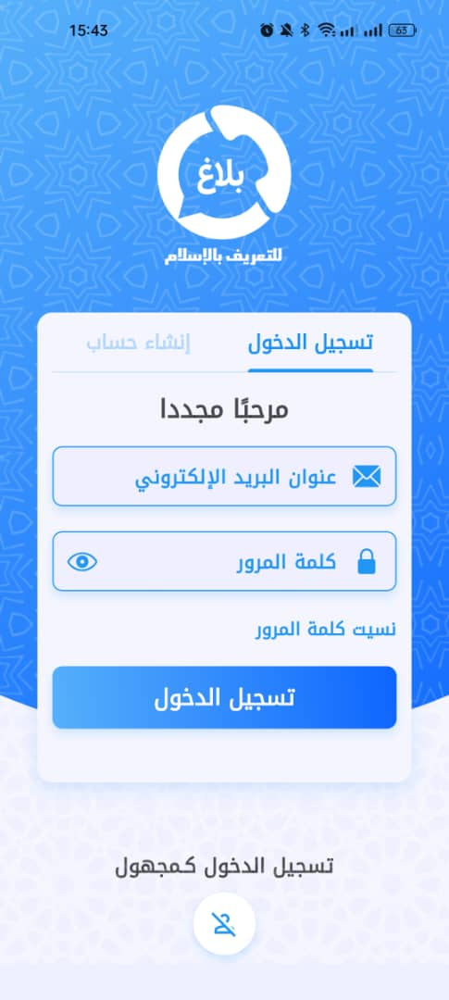 | 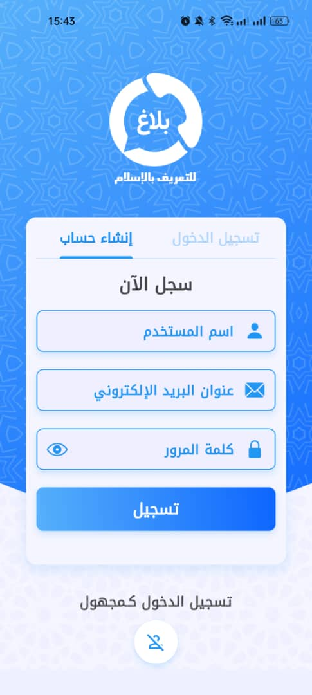 | 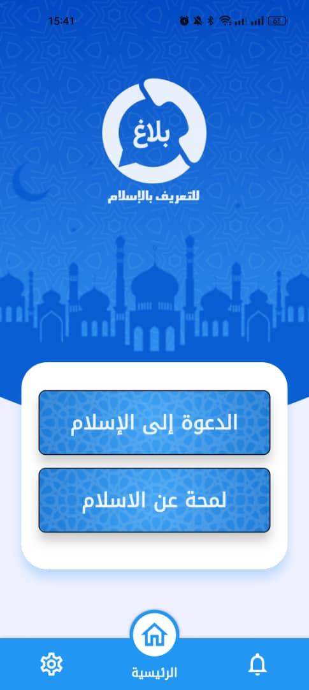 |

| Profile | Settings | Define Islam |
|---|---|---|
|  | 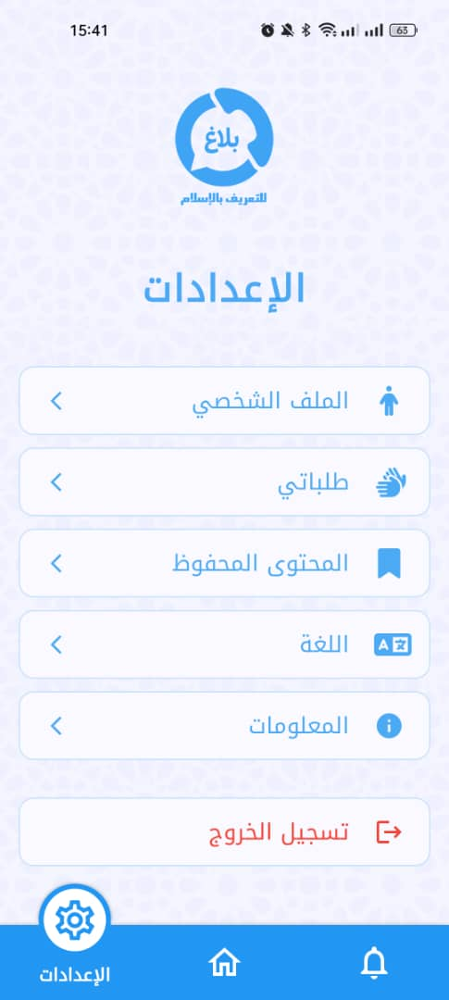 | 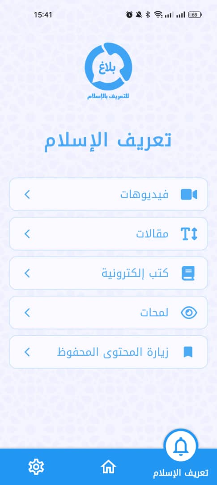 |

| Information | Contact Us | Saved Content |
|---|---|---|
| 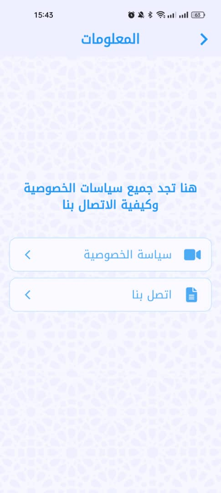 | 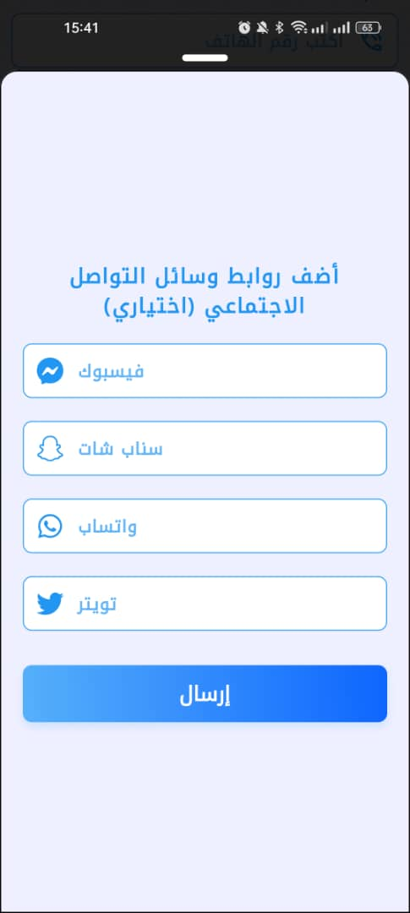 | 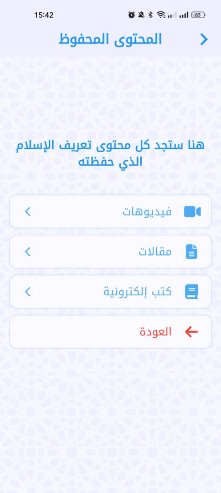 |

| Content Main Branch | Content Second Branch | Content Main Screen |
|---|---|---|
| 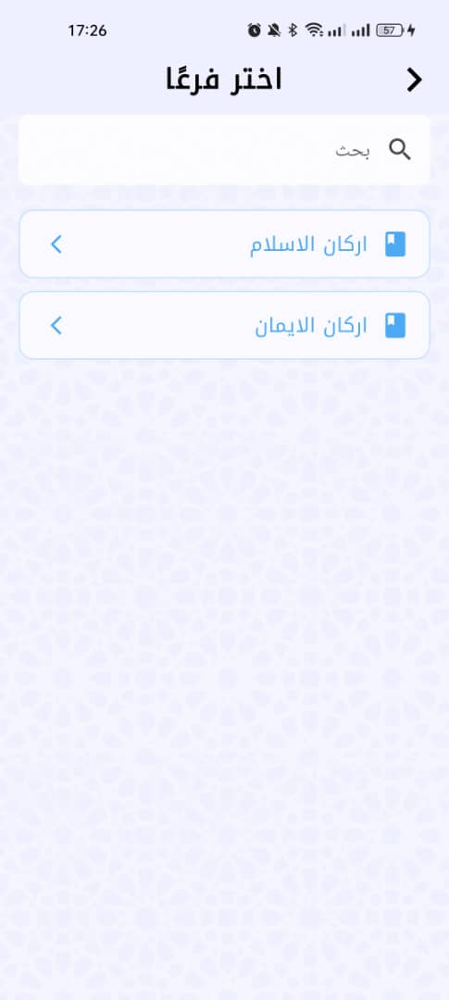 | 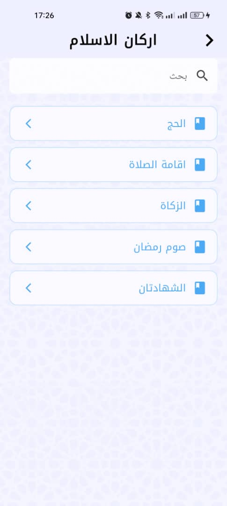 | 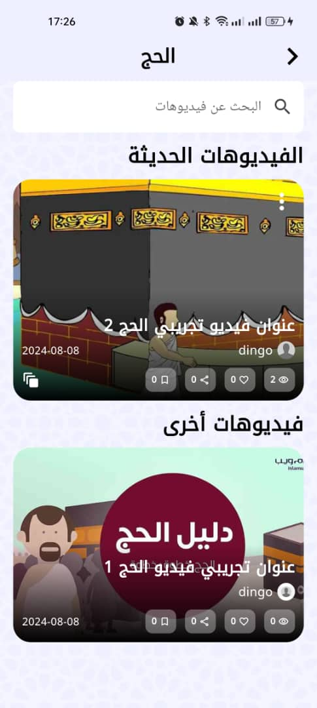 |

| Da'wa Form 1 | Da'wa Form 2 | Define Islam EN |
|---|---|---|
| 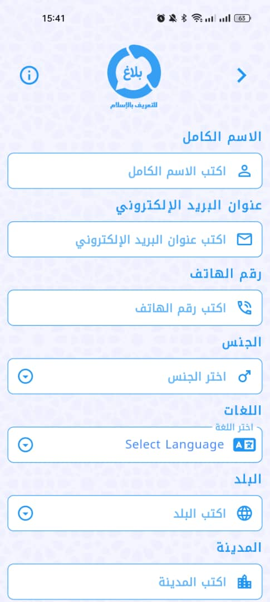 | 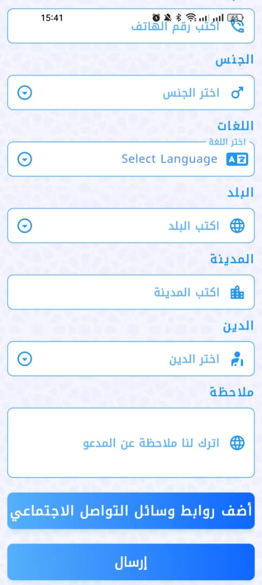 | 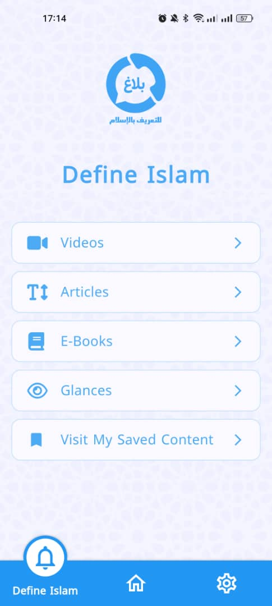 |

| Login English | Register English | Home English |
|---|---|---|
| 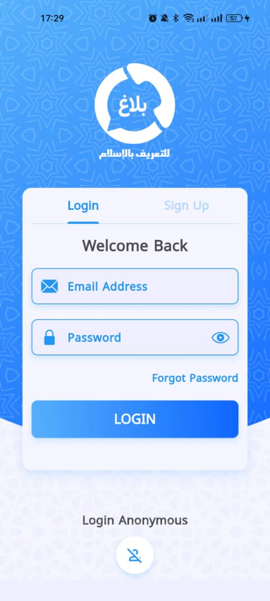 | 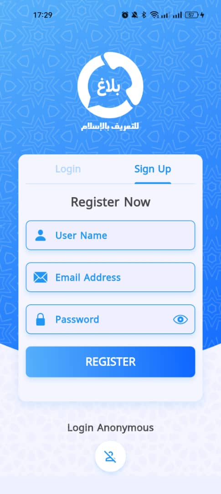 | 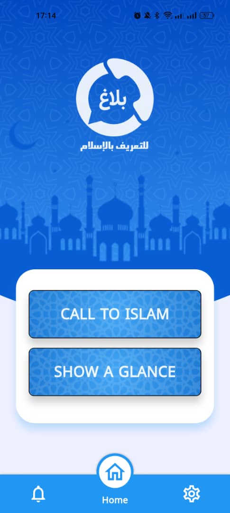 |

    <h2>Admins-Panel Application Screenshots</h2>

 |  | 

 |  | 

 |  | 

 |  | 

 |  | 

 |  | 

 |  | 

 |  | 

 |  | 

 |  | 

 |  | 

 |  | 

 |  | 

 |  | 

 |  | 

 |  | 

